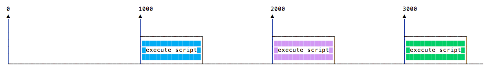
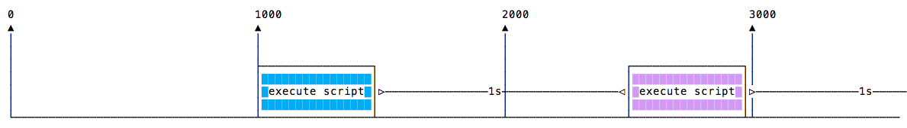

## `setTimeout()`

Lorsque vous écrivez du code JavaScript, vous pouvez souhaiter retarder l'exécution d'une fonction.

C'est le rôle de `setTimeout`. Vous spécifiez une fonction de rappel à exécuter plus tard, et une valeur exprimant le délai dans lequel vous voulez qu'elle soit exécutée, en millisecondes :

```js
setTimeout(() => {
  // s'exécute après 2 secondes
}, 2000);

setTimeout(() => {
  // s'exécute après 50 millisecondes
}, 50);
```

Cette syntaxe définit une nouvelle fonction. Vous pouvez y appeler n'importe quelle autre fonction, ou passer un nom de fonction existant, et un ensemble de paramètres :

```js
const myFunction = (firstParam, secondParam) => {
  // faire quelque chose
};

// fonctionne après 2 secondes
setTimeout(myFunction, 2000, firstParam, secondParam);
```

`setTimeout` renvoie l'id du timer. Ceci n'est généralement pas utilisé, mais vous pouvez stocker cet id, et l'effacer si vous voulez supprimer l'exécution de cette fonction planifiée :

```js
const id = setTimeout(() => {
  // devrait fonctionner après 2 secondes
}, 2000);

// J'ai changé d'avis
clearTimeout(id);
```

### Délai de zéro

Si vous spécifiez le délai de temporisation à `0`, la fonction de rappel sera exécutée dès que possible, mais après l'exécution de la fonction courante :

```js
setTimeout(() => {
  console.log('après ');
}, 0);

console.log(' avant ');
```

Ce code va s'afficher

```bash
avant
après
```

Ceci est particulièrement utile pour éviter de bloquer le CPU sur des tâches intensives et laisser d'autres fonctions s'exécuter pendant l'exécution d'un calcul lourd, en mettant des fonctions en attente dans le planificateur.

> Certains navigateurs (IE et Edge) implémentent une méthode `setImmediate()` qui fait exactement la même fonctionnalité, mais elle n'est pas standard et [non disponible sur les autres navigateurs](https://caniuse.com/#feat=setimmediate). Mais c'est une fonction standard dans Node.js.

## `setInterval()`

`setInterval` est une fonction similaire à `setTimeout`, avec une différence : au lieu d'exécuter la fonction callback une fois, elle l'exécutera pour toujours, à l'intervalle de temps spécifique que vous spécifiez (en millisecondes) :

```js
setInterval(() => {
  // fonctionne toutes les 2 secondes
}, 2000);
```

La fonction ci-dessus s'exécute toutes les 2 secondes à moins que vous ne lui demandiez de s'arrêter, en utilisant `clearInterval`, en lui passant l'identifiant d'intervalle que `setInterval` a retourné :

```js
const id = setInterval(() => {
  // fonctionne toutes les 2 secondes
}, 2000);

clearInterval(id);
```

Il est courant d'appeler `clearInterval` à l'intérieur de la fonction de rappel setInterval, pour laisser la fonction déterminer automatiquement si elle doit être relancée ou arrêtée. Par exemple, ce code exécute quelque chose à moins que App.somethingIWait ait la valeur `arrived` :

```js
const interval = setInterval(() => {
  if (App.somethingIWait === 'arrived') {
    clearInterval(interval);
  }
  // faire autrement
}, 100);
```

## Récursif setTimeout

`setInterval` lance une fonction toutes les n millisecondes, sans tenir compte du moment où une fonction a terminé son exécution.

Si une fonction prend toujours le même temps, tout va bien :



La fonction peut prendre des temps d'exécution différents, en fonction des conditions du réseau par exemple :


Et peut-être qu'une longue exécution chevauche la suivante :


Pour éviter cela, vous pouvez programmer un setTimeout récursif qui sera appelé à la fin de la fonction de rappel :

```js
const myFunction = () => {
  // faire quelque chose

  setTimeout(myFunction, 1000);
};

setTimeout(myFunction, 1000);
```

pour réaliser ce scénario :



`setTimeout` et `setInterval` sont disponibles dans Node.js, via le [module Timers](https://nodejs.org/api/timers.html).

Node.js fournit également `setImmediate()`, qui est équivalent à l'utilisation de `setTimeout() => {}, 0)`, principalement utilisé pour travailler avec la boucle d'événement de Node.js.
