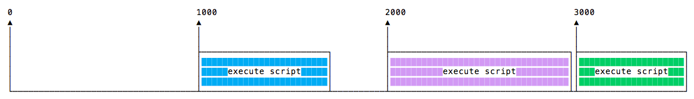
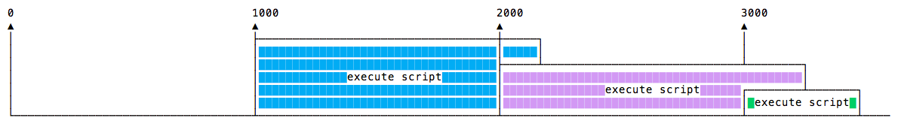

## `setTimeout()`

Quando estiveres a escrever código de JavaScript, podes desejar atrasar a execução de uma função.

Isto é trabalhado para a `setTimeout`. Tu especificas uma função de resposta para ser executada mais tarde, e um valor expressando o quão mais tarde queres que a mesma seja executada, em milissegundos:

```js
setTimeout(() => {
  // executa depois de 2 segundos
}, 2000);

setTimeout(() => {
  // executa depois de 50 milissegundos
}, 50);
```

A sintaxe a seguir define uma nova função. Tu podes chamar qualquer outra função que quiseres nela, ou podes passar um nome de função existente, e um conjunto de parâmetros:

```js
const myFunction = (firstParam, secondParam) => {
  // fazer alguma coisa
};

// executa depois 2 segundos
setTimeout(myFunction, 2000, firstParam, secondParam);
```

A função `setTimeout` retorna o identificador do temporizador. Isto geralmente não é usado, mas podes armazenar este identificador, e limpá-lo se quiseres eliminar esta execução de função agendada:

```js
const id = setTimeout(() => {
  // executaria depois de 2 segundos
}, 2000);

// Eu mudei de ideia
clearTimeout(id);
```

### Atraso Zero

Se especificares o atraso da pausa para `0`, a função de resposta será executada o mais cedo possível, mas depois da execução da função atual:

```js
setTimeout(() => {
  console.log('after ');
}, 0);

console.log(' before ');
```

Este código imprimirá:

```bash
before
after
```

Isto é especialmente útil para evitar o bloqueio da CPU em tarefas intensivas e deixar as outras funções serem executadas enquanto realizamos um cálculo intenso, pelo enfileiramento de funções no agendador.

> Alguns navegadores (Internet Explorer e Microsoft Edge) implementam um método `setImmediate()` que faz esta mesma exata funcionalidade, mas não é padronizada e [não está disponível em outros navegadores](https://caniuse.com/#feat=setimmediate). Mas é uma função padronizada na Node.js.

## `setInterval()`

A `setInterval` é uma função parecida com a `setTimeout`, com uma diferença: no lugar de executar a função de resposta apenas uma vez, irá executá-la para sempre, num intervalo de tempo específico que especificares (em milissegundos):

```js
setInterval(() => {
  // executa a cada 2 segundos
}, 2000);
```

A função acima executa a cada 2 segundos a menos que a digas para parar, usando a função `clearInterval`, passando-a o identificador do intervalo que a `setInterval` retornou:

```js
const id = setInterval(() => {
  // executa a cada 2 segundos
}, 2000);

clearInterval(id);
```

É comum chamar a função `clearInterval` dentro da função de resposta da função `setInterval`, para permiti-la determinar automaticamente se deveria executar novamente ou parar. Por exemplo este código executa alguma coisa a menos que o valor de `App.somethingInWait` seja estritamente igual a sequência de caracteres `arrived`:

```js
const interval = setInterval(() => {
  if (App.somethingIWait === 'arrived') {
    clearInterval(interval);
  }
  // de outro modo faça coisas
}, 100);
```

## `setTimeout` Recursivo

A função `setInterval` inicia uma função a cada `n` milissegundos, sem nenhuma consideração sobre quando uma função terminou a sua execução.

Se uma função sempre demorar a mesma quantidade de tempo, está tudo bem:


Talvez a função demora diferentes tempos de execução, dependendo das condições de rede por exemplo:



E talvez uma longa execução sobreponha a próxima execução:



Para evitar isto, podes agendar uma função `setTimeout` recursiva para ser chamada quando a função de resposta terminar:

```js
const myFunction = () => {
  // fazer alguma coisa

  setTimeout(myFunction, 1000);
};

setTimeout(myFunction, 1000);
```

para alcançar este cenário:


As funções `setTimeout` e `setInterval` estão disponíveis na Node.js, através do [módulo `timers`](https://nodejs.org/api/timers.html).

A Node.js também fornece `setImmediate()`, que é equivalente a usar `setTimeout(() => {}, 0)`, na maior parte das vezes usada para trabalhar com o Laço de Evento da Node.js.
