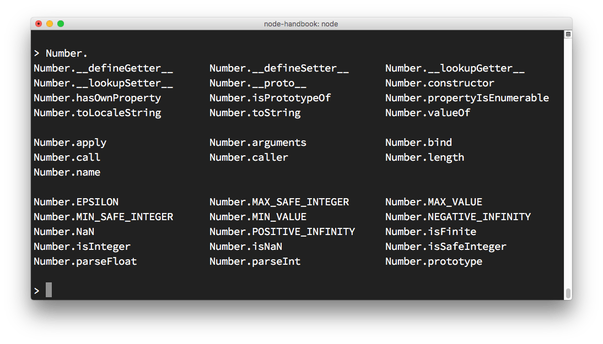
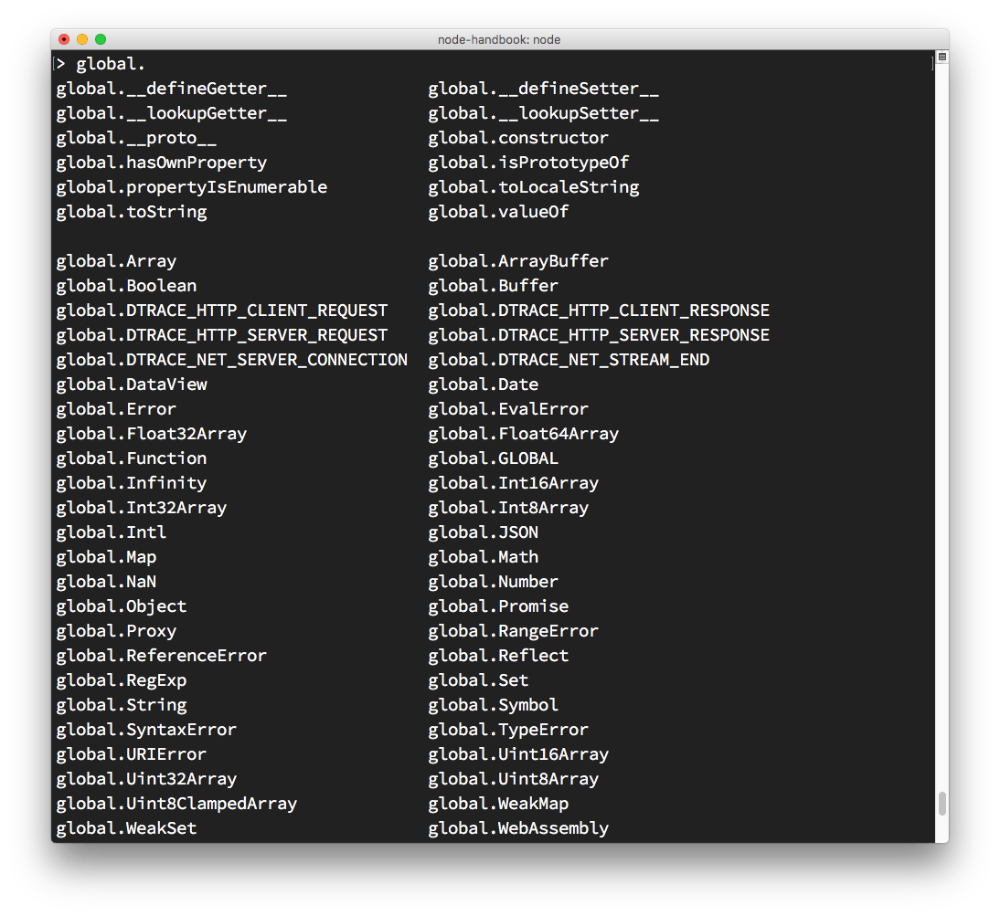

The `node` command is the one we use to run our Node.js scripts:

```bash
node script.js
```

If we omit the filename, we use it in REPL mode:

```bash
node
```

> Note: REPL also known as Read Evaluate Print Loop is a programming language environment (basically a console window) that takes single expression as user input and returns the result back to the console after execution.

If you try it now in your terminal, this is what happens:

```bash
❯ node
>
```

the command stays in idle mode and waits for us to enter something.

> Tip: if you are unsure how to open your terminal, google "How to open terminal on \<your-operating-system\>".

The REPL is waiting for us to enter some JavaScript code, to be more precise.

Start simple and enter

```console
> console.log('test')
test
undefined
>
```

The first value, `test`, is the output we told the console to print, then we get undefined which is the return value of running `console.log()`.

We can now enter a new line of JavaScript.

## Use the tab to autocomplete

The cool thing about the REPL is that it's interactive.

As you write your code, if you press the `tab` key the REPL will try to autocomplete what you wrote to match a variable you already defined or a predefined one.

## Exploring JavaScript objects

Try entering the name of a JavaScript class, like `Number`, add a dot and press `tab`.

The REPL will print all the properties and methods you can access on that class:



## Explore global objects

You can inspect the globals you have access to by typing `global.` and pressing `tab`:



## The \_ special variable

If after some code you type `_`, that is going to print the result of the last operation.

## Dot commands

The REPL has some special commands, all starting with a dot `.`. They are

* `.help`: shows the dot commands help
* `.editor`: enables editor mode, to write multiline JavaScript code with ease. Once you are in this mode, enter ctrl-D to run the code you wrote.
* `.break`: when inputting a multi-line expression, entering the .break command will abort further input. Same as pressing ctrl-C.
* `.clear`: resets the REPL context to an empty object and clears any multi-line expression currently being input.
* `.load`: loads a JavaScript file, relative to the current working directory
* `.save`: saves all you entered in the REPL session to a file (specify the filename)
* `.exit`: exits the repl (same as pressing ctrl-C two times)

The REPL knows when you are typing a multi-line statement without the need to invoke `.editor`.

For example if you start typing an iteration like this:

```js
[1, 2, 3].forEach(num => {
```

and you press `enter`, the REPL will go to a new line that starts with 3 dots, indicating you can now continue to work on that block.

```js
... console.log(num)
... })
```

If you type `.break` at the end of a line, the multiline mode will stop and the statement will not be executed.
