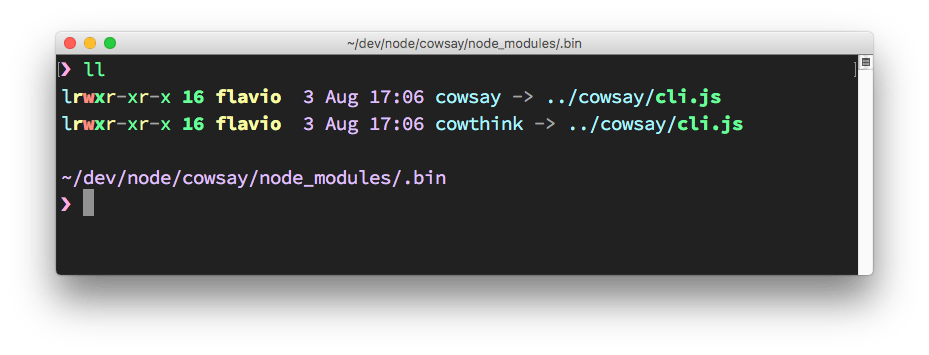
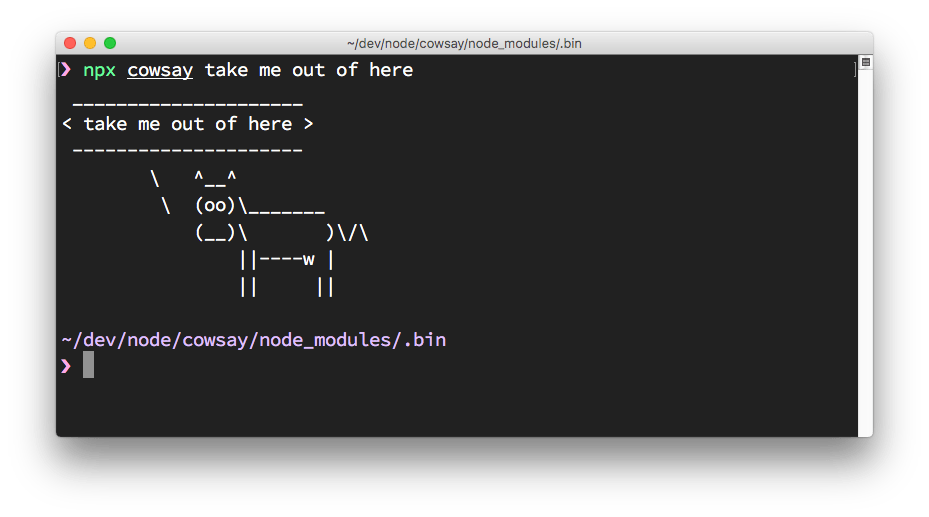

When you install using `npm` a package into your `node_modules` folder, or also globally, how do you use it in your Node.js code?

Say you install `lodash`, the popular JavaScript utility library, using

```bash
npm install lodash
```

This is going to install the package in the local `node_modules` folder.

To use it in your code, you just need to import it into your program using `require`:

```js
const _ = require('lodash')
```

What if your package is an executable?

In this case, it will put the executable file under the `node_modules/.bin/` folder.

One easy way to demonstrate this is [cowsay](https://www.npmjs.com/package/cowsay).

The cowsay package provides a command line program that can be executed to make a cow say something (and other animals as well 🦊).

When you install the package using `npm install cowsay`, it will install itself and a few dependencies in the `node_modules` folder:


There is a hidden `.bin` folder, which contains symbolic links to the cowsay binaries:



How do you execute those?

You can of course type `./node_modules/.bin/cowsay` to run it, and it works, but `npx`, included in the recent versions of `npm` (since 5.2), is a much better option. You just run:

```bash
npx cowsay
```

and `npx` will find the package location.


