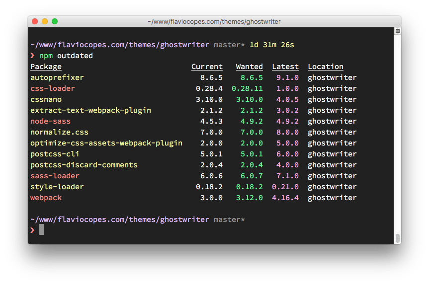

When you install a package using `npm install <packagename>`, the latest available version of the package is downloaded and put in the `node_modules` folder, and a corresponding entry is added to the `package.json` and `package-lock.json` files that are present in your current folder.

npm calculates the dependencies and installs the latest available version of those as well.

Let's say you install [`cowsay`](https://www.npmjs.com/package/cowsay), a cool command line tool that lets you make a cow say _things_.

When you `npm install cowsay`, this entry is added to the `package.json` file:

```json
{
  "dependencies": {
    "cowsay": "^1.3.1"
  }
}
```

and this is an extract of `package-lock.json`, where we removed the nested dependencies for clarity:

```json
{
  "requires": true,
  "lockfileVersion": 1,
  "dependencies": {
    "cowsay": {
      "version": "1.3.1",
      "resolved": "https://registry.npmjs.org/cowsay/-/cowsay-1.3.1.tgz",
      "integrity": "sha512-3PVFe6FePVtPj1HTeLin9v8WyLl+VmM1l1H/5P+BTTDkMAjufp+0F9eLjzRnOHzVAYeIYFF5po5NjRrgefnRMQ==",
      "requires": {
        "get-stdin": "^5.0.1",
        "optimist": "~0.6.1",
        "string-width": "~2.1.1",
        "strip-eof": "^1.0.0"
      }
    }
  }
}
```

Now those 2 files tell us that we installed version `1.3.1` of cowsay, and our rule for updates is `^1.3.1`, which for the npm versioning rules means that npm can update to patch and minor releases: `1.3.2`, `1.4.0` and so on.

If there is a new minor or patch release and we type `npm update`, the installed version is updated, and the `package-lock.json` file diligently filled with the new version.

Since npm version 5.0.0, `npm update` will update the `package.json` with the updated version. Use `npm update --no-save` to not update `package.json`.

To discover new releases of the packages, you run `npm outdated`.

Here's the list of a few outdated packages in one repository that wasn't updated for quite a while:



Some of those updates are major releases. Running `npm update` won't update the version of those. Major releases are never updated in this way because they (by definition) introduce breaking changes, and `npm` wants to save you trouble.

To update all packages to a new major version, install the `npm-check-updates` package globally:

```bash
npm install -g npm-check-updates
```

then run it:

```bash
ncu -u
```

this will upgrade all the version hints in the `package.json` file, to `dependencies` and `devDependencies`, so npm can install the new major version.

You are now ready to run the update:

```bash
npm update
```

If you just downloaded the project without the `node_modules` dependencies and you want to install the shiny new versions first, just run

```bash
npm install
```
