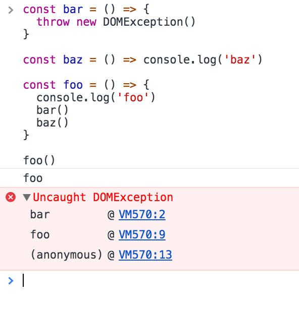
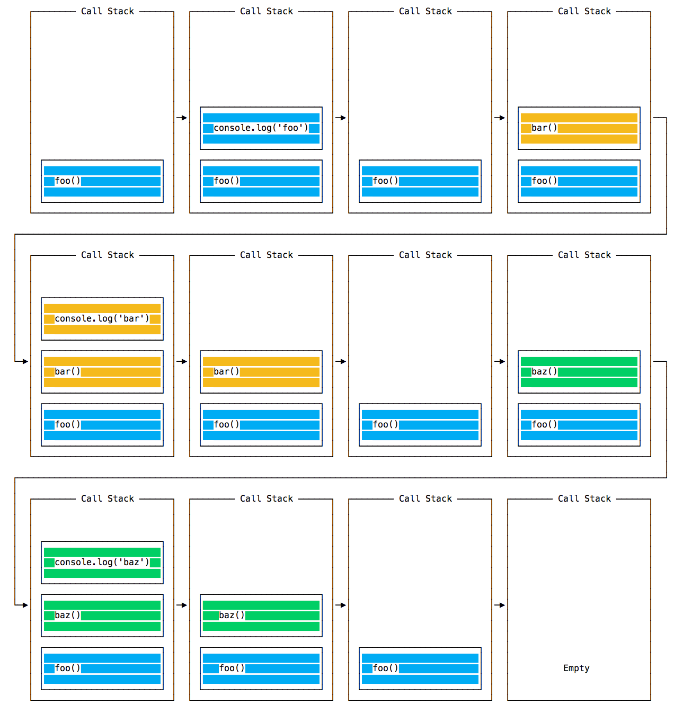
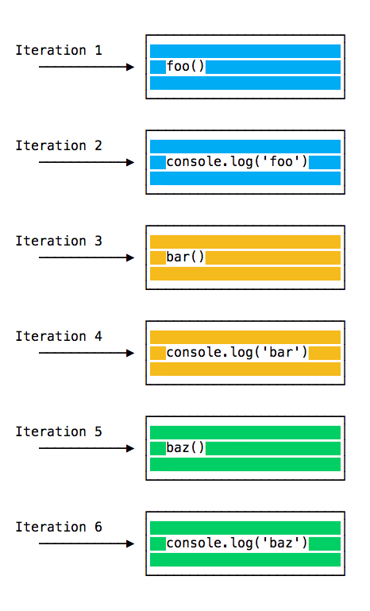
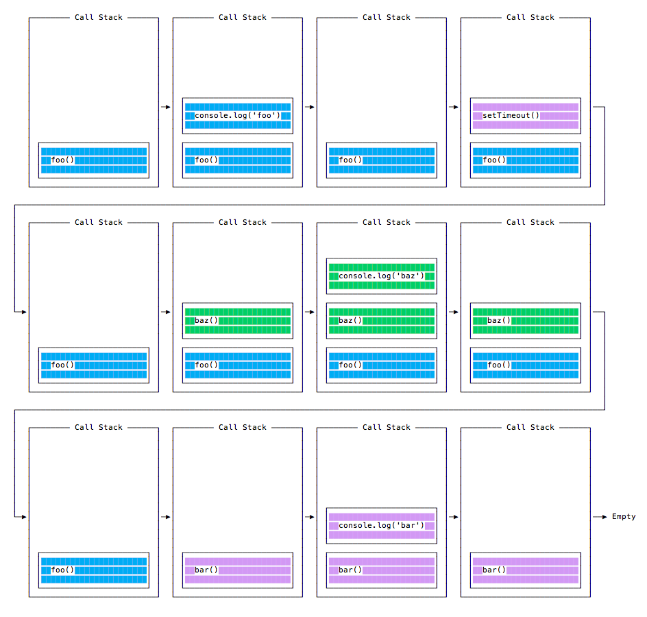
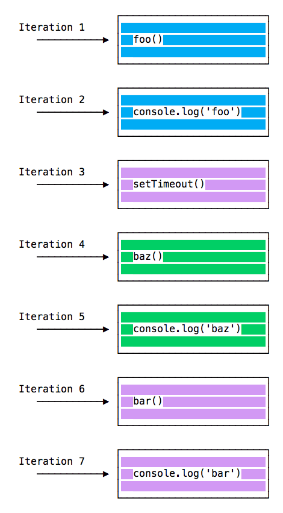
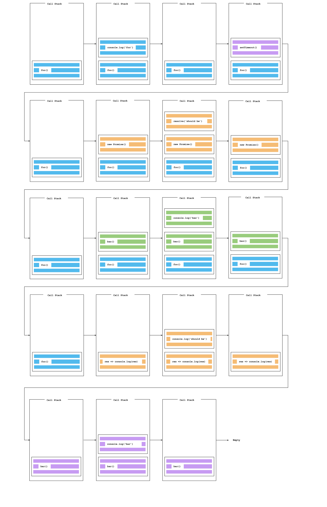

## Introduction

The **Event Loop** is one of the most important aspects to understand about Node.js.

Why is this so important? Because it explains how Node.js can be asynchronous and have non-blocking I/O, and so it explains basically the "killer app" of Node.js, the thing that made it this successful.

The Node.js JavaScript code runs on a single thread. There is just one thing happening at a time.

This is a limitation that's actually very helpful, as it simplifies a lot how you program without worrying about concurrency issues.

You just need to pay attention to how you write your code and avoid anything that could block the thread, like synchronous network calls or infinite loops.

In general, in most browsers there is an event loop for every browser tab, to make every process isolated and avoid a web page with infinite loops or heavy processing to block your entire browser.

The environment manages multiple concurrent event loops, to handle API calls for example. Web Workers run in their own event loop as well.

You mainly need to be concerned that _your code_ will run on a single event loop, and write code with this thing in mind to avoid blocking it.

## Blocking the event loop

Any JavaScript code that takes too long to return back control to the event loop will block the execution of any JavaScript code in the page, even block the UI thread, and the user cannot click around, scroll the page, and so on.

Almost all the I/O primitives in JavaScript are non-blocking. Network requests, filesystem operations, and so on. Being blocking is the exception, and this is why JavaScript is based so much on callbacks, and more recently on promises and async/await.

## The call stack

The call stack is a LIFO (Last In, First Out) stack.

The event loop continuously checks the **call stack** to see if there's any function that needs to run.

While doing so, it adds any function call it finds to the call stack and executes each one in order.

You know the error stack trace you might be familiar with, in the debugger or in the browser console? The browser looks up the function names in the call stack to inform you which function originates the current call:



## A simple event loop explanation

Let's pick an example:

<iframe
  title="A simple event loop explanation"
  src="https://glitch.com/embed/#!/embed/nodejs-dev-0029-01?path=server.js&previewSize=20&attributionHidden=true&sidebarCollapsed=true"
  alt="nodejs-dev-0029-01 on Glitch"
  style="height: 400px; width: 100%; border: 0;">
</iframe>

<!--```js
const bar = () => console.log('bar')

const baz = () => console.log('baz')

const foo = () => {
  console.log('foo')
  bar()
  baz()
}

foo()
```

This code prints

```txt
foo
bar
baz
```

as expected.-->

When this code runs, first `foo()` is called. Inside `foo()` we first call `bar()`, then we call `baz()`.

At this point the call stack looks like this:



The event loop on every iteration looks if there's something in the call stack, and executes it:



until the call stack is empty.

## Queuing function execution

The above example looks normal, there's nothing special about it: JavaScript finds things to execute, runs them in order.

Let's see how to defer a function until the stack is clear.

The use case of `setTimeout(() => {}, 0)` is to call a function, but execute it once every other function in the code has executed.

Take this example:

<iframe
  title="Queuing function execution"
  src="https://glitch.com/embed/#!/embed/nodejs-dev-0029-02?path=server.js&previewSize=20&attributionHidden=true&sidebarCollapsed=true"
  alt="nodejs-dev-0029-02 on Glitch"
  style="height: 400px; width: 100%; border: 0;">
</iframe>

<!--```js
const bar = () => console.log('bar')

const baz = () => console.log('baz')

const foo = () => {
  console.log('foo')
  setTimeout(bar, 0)
  baz()
}

foo()
```-->

This code prints, maybe surprisingly:

```bash
foo
baz
bar
```

When this code runs, first foo() is called. Inside foo() we first call setTimeout, passing `bar` as an argument, and we instruct it to run immediately as fast as it can, passing 0 as the timer. Then we call baz().

At this point the call stack looks like this:



Here is the execution order for all the functions in our program:



Why is this happening?

## The Message Queue

When setTimeout() is called, the Browser or Node.js starts the timer. Once the timer expires, in this case immediately as we put 0 as the timeout, the callback function is put in the **Message Queue**.

The Message Queue is also where user-initiated events like click or keyboard events, or fetch responses are queued before your code has the opportunity to react to them. Or also DOM events like `onLoad`.

**The loop gives priority to the call stack, and it first processes everything it finds in the call stack, and once there's nothing in there, it goes to pick up things in the message queue.**

We don't have to wait for functions like `setTimeout`, fetch or other things to do their own work, because they are provided by the browser, and they live on their own threads. For example, if you set the `setTimeout` timeout to 2 seconds, you don't have to wait 2 seconds - the wait happens elsewhere.

## ES6 Job Queue

ECMAScript 2015 introduced the concept of the Job Queue, which is used by Promises (also introduced in ES6/ES2015). It's a way to execute the result of an async function as soon as possible, rather than being put at the end of the call stack.

Promises that resolve before the current function ends will be executed right after the current function.

I find nice the analogy of a rollercoaster ride at an amusement park: the message queue puts you at the back of the queue, behind all the other people, where you will have to wait for your turn, while the job queue is the fastpass ticket that lets you take another ride right after you finished the previous one.

Example:

<iframe
  title="ECMAScript 2015 Job Queue"
  src="https://glitch.com/embed/#!/embed/nodejs-dev-0029-03?path=server.js&previewSize=35&attributionHidden=true&sidebarCollapsed=true"
  alt="nodejs-dev-0029-03 on Glitch"
  style="height: 400px; width: 100%; border: 0;">
</iframe>

<!--```js
const bar = () => console.log('bar')

const baz = () => console.log('baz')

const foo = () => {
  console.log('foo')
  setTimeout(bar, 0)
  new Promise((resolve, reject) =>
    resolve('should be right after baz, before bar')
  ).then(resolve => console.log(resolve))
  baz()
}

foo()
```

This prints

```txt
foo
baz
should be right after baz, before bar
bar
```-->

That's a big difference between Promises (and Async/await, which is built on promises) and plain old asynchronous functions through `setTimeout()` or other platform APIs.

Finally, here's what the call stack looks like for the example above:


