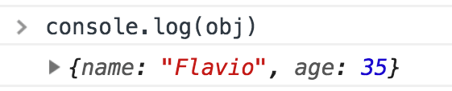
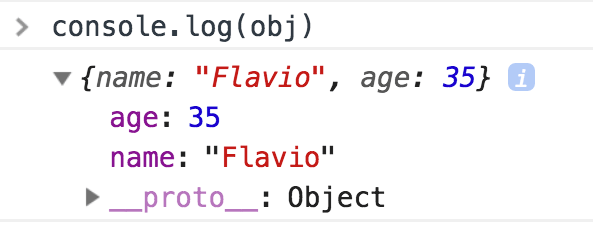

When you type `console.log()` into a JavaScript program that runs in the browser, that is going to create a nice entry in the Browser Console:



Once you click the arrow, the log is expanded, and you can clearly see the object properties:



In Node.js, the same happens.

We don’t have such luxury when we log something to the console, because that’s going to output the object to the shell if you run the Node.js program manually, or to the log file. You get a string representation of the object.

Now, all is fine until a certain level of nesting. After two levels of nesting, Node.js gives up and prints `[Object]` as a placeholder:

```js
const obj = {
  name: 'joe',
  age: 35,
  person1: {
    name: 'Tony',
    age: 50,
    person2: {
      name: 'Albert',
      age: 21,
      person3: {
        name: 'Peter',
        age: 23
      }
    }
  }
}
console.log(obj)


{
  name: 'joe',
  age: 35,
  person1: {
    name: 'Tony',
    age: 50,
    person2: {
      name: 'Albert',
      age: 21,
      person3: [Object]
    }
  }
}
```

How can you print the whole object?

The best way to do so, while preserving the pretty print, is to use

```js
console.log(JSON.stringify(obj, null, 2))
```

where `2` is the number of spaces to use for indentation.

Another option is to use

```js
require('util').inspect.defaultOptions.depth = null
console.log(obj)
```

but the problem is that the nested objects after level 2 are now flattened, and this might be a problem with complex objects.
